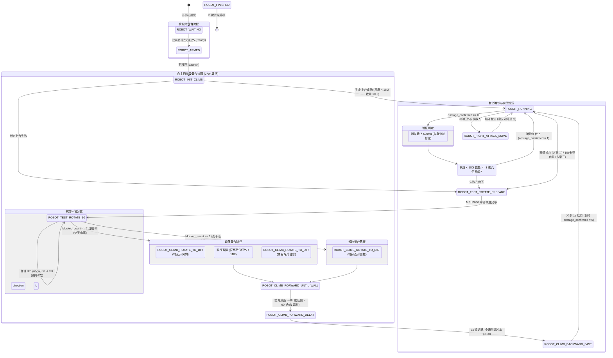

# STM32 FightRobot FreeRTOS 架构与代码设计说明文档

本文档旨在帮助开发人员和算法设计者快速读懂 `Core/Src/freertos.c` 的核心架构、任务分配、状态机控制流及关键底层逻辑。

---

## 1. 软件架构与 FreeRTOS 任务划分

系统基于 FreeRTOS 实时操作系统运行，将不同的功能解耦为不同的线程（Task），由操作系统进行抢占式调度。

```mermaid
graph TD
    CommTask[Comm_Task: 串口接收解码遥控指令] -->|全局变量| MotionTask[Motion_Task: 逻辑脑/状态机]
    SensorTask[Sensor_Task: 传感器采样] -->|ADC/I2C/GPIO| MotionTask
    VisionTask[: OpenMV视觉处理] -->|目标数据| MotionTask
    MotionTask -->|控制状态与车速| MotorTask[Motor_Task: 轮速PID闭环驱动]Vision_Task
    MotionTask -->|偏航控制指令| AngleTask[Angle_Task: 航向角度环PID锁角]
    AngleTask -->|转向修正速度| MotorTask
```

### 任务清单表

| 任务名称 (Thread Name) | 入口函数 (Entry Function) | 优先级 | 周期 (Period) | 核心职责 |
| :--- | :--- | :--- | :--- | :--- |
| `Motion_Task` | `StartMotion_Task` | Normal | 20ms | **逻辑大脑**。管理主控状态机，处理遥控手柄切换、台下 270° 自主扫描、对齐顶墙、全速登台、上台确诊、台上自动巡逻寻敌、跌落防护及卡死自愈。 |
| `Motor_Task` | `StartMotor_Task` | Normal | 20ms | **电机驱动**。对 4 路轮圈电机实施速度闭环 PID 控制；在登台/冲刺时自动开启开环直通以释放 100% 满扭矩。 |
| `Angle_Task` | `StartAngle_Task` | Normal | 50ms | **角度纠偏**。利用 MPU6050 陀螺仪的 Yaw 轴进行闭环 PID 计算，输出差速修正量以锁定车体航向。 |
| `Comm_Task` | `StartComm_Task` | Normal | 异步 DMA | **通信解码**。基于串口空闲中断 + DMA 接收并解析 Gamepad 手柄数据，若遥控离线则触发自动降级。 |
| `Sensor_Task` | `StartSensor_Task` | Normal | 10ms | **传感器数据采集**。更新 4 路底盘灰度、1 路高位防跌落红外、8 路避障红外、左右自适应启动红外及双侧测距激光数值。 |
| `Vision_Task` | `StartVision_Task` | Normal | 异步 | **视觉通信**。接收识别模组传来的能量块偏航角及靶点坐标。 |
| `defaultTask` | `StartDefaultTask` | Normal | 1000ms | **系统心跳/空闲任务**。 |

---

## 2. 状态机设计与控制流 (`RobotState_e`)

主任务 `StartMotion_Task` 通过枚举变量 `robot_state` 驱动整车控制流。状态机分为三大逻辑线：**软启动登台线**、**跌落/卡死自愈自主登台线**、**台上战斗/巡逻/寻敌线**。



### 状态枚举值及核心行为表

| 状态名称 (State Enum) | 数值 | 所在流程 | 对应底盘动作与跳转逻辑 |
| :--- | :---: | :--- | :--- |
| `ROBOT_WAITING` | 0 | 软启动 | 静止刹车。连续检测到左右红外传感器读数均小于自适应阻挡阈值时，跳转至 `ROBOT_ARMED`。 |
| `ROBOT_ARMED` | 1 | 软启动 | 静止刹车，自动清零 Z 轴偏航角。检测到两手拿开、红外读数恢复开阔后，跳转至 `ROBOT_INIT_CLIMB`。 |
| `ROBOT_INIT_CLIMB` | 2 | 软启动 | 前 0.1s 向前慢行顶紧围栏，后 0.6s 全速倒车（-100）开环输出冲台。冲完后停留 200ms 检测：若底盘灰度 `<180f` 数量 `>=3`，跳转至 `ROBOT_RUNNING` 并将 `onstage_confirmed=1`；否则跳转至 `ROBOT_TEST_ROTATE_PREPARE`。 |
| `ROBOT_TEST_ROTATE_PREPARE` | 11 | 自主登台 | 静止刹车，重置 Yaw 角并等待 500ms 获取真实零偏。保存当前高位红外数据作为 `S0` 读数，锁定目标转向 `90°`，跳转至 `ROBOT_TEST_ROTATE_90`。 |
| `ROBOT_TEST_ROTATE_90` | 12 | 自主登台 | 原位自转（Yaw 闭环控制）。每次角度对齐后，刹车并停顿 100ms 记录高位红外数值（`S1`、`S2`、`S3`），累加 `rotate_step`。完成 3 次旋转后（共扫描 270°）：<br>1. 若有两个相邻方向被阻挡，判定为“角落”；<br>2. 若仅有一个方向被阻挡，判定为“边缘”；<br>3. 否则判定为正常自愈，返回 `ROBOT_RUNNING`。 |
| `ROBOT_CLIMB_ROTATE_TO_DIR` | 17 | 自主登台 | 车体原位旋转到指定的 `climb_target_angle`。转向对齐后跳转到 `climb_next_state`（可能为顶墙对齐或角落前行）。 |
| `ROBOT_CLIMB_FORWARD_UNTIL_UP_IR`| 18 | 自主登台 | **角落脱困步**。向前直行，直至后上方红外测距 `IR_Distance_UP > 110.0f`（表示车尾已完全越过侧向高围栏），或触发 2.5s 超时保护。完成后转向 `opp_smaller` 面向围栏，跳转至 `ROBOT_CLIMB_FORWARD_UNTIL_WALL`。 |
| `ROBOT_CLIMB_FORWARD_UNTIL_WALL` | 14 | 自主登台 | **顶墙前置直行**。以速度 25 向前开路。当前方测距 `IR_Distance_F > 48.0f`（代表前方射向高位开阔区）或后侧 `IR_Distance_B > 60.0f` 时触发，跳转至 `ROBOT_CLIMB_FORWARD_DELAY`。 |
| `ROBOT_CLIMB_FORWARD_DELAY` | 15 | 自主登台 | **开阔直行延时**。继续前行 1000ms，以保证车体完全贴近台阶边缘并腾出足够的加速倒退冲量空间。 |
| `ROBOT_CLIMB_BACKWARD_FAST` | 16 | 自主登台 | **全速倒车冲台**。输出全速倒退命令（-100）持续 1000ms，开环直通。结束后制动，跳转至 `ROBOT_RUNNING`，并将 `onstage_confirmed` 复位为 `0` 等待确诊。 |
| `ROBOT_RUNNING` | 3 | 台上运行 | **自动巡台/战斗**。若 `onstage_confirmed == 0`，先刹车 500ms 确诊上台；确诊通过后，开启 8 向红外寻敌，发现敌人触发 `ROBOT_FIGHT_ATTACK_MOVE`，无敌人时自动边缘巡逻（`Auto_Control_Logic_Laser`）并寻块推下（`Detect_Laser`）。 |
| `ROBOT_FIGHT_ATTACK_MOVE` | 20 | 台上运行 | **实战冲撞追击**。向敌人方向以速度 18 挺进，在前进中根据 8 向红外实时微调航向。一旦激光测距 `> 260` 判定为边缘，强力制动 80ms，后退 220ms，转向避让 450ms，恢复 `ROBOT_RUNNING`。 |
| `ROBOT_FINISHED` | 10 | 停机状态 | 电机强力闭环零速刹车。按下遥控 `X` 键或通过遥控离线保护恢复。 |

---

## 3. 核心机制设计

### A. 自动寻敌劫持防护机制
为了解决车在台下容易把通道围栏当作“敌人”误触发旋转对齐而产生 180° 对折打转死循环的问题，代码中实施了**双层防护**：
- **第一层防御（状态验证）**：在 `ROBOT_RUNNING` 下，如果 `onstage_confirmed == 0`，则拦截所有下层逻辑。直接在开头进行台上确诊，未确诊通过前，**绝对不运行**手柄切换以后的寻敌指令。
- **第二层防御（寻敌包裹）**：底部的自动战斗逻辑整体被包裹在 `if (onstage_confirmed == 1 || is_test_mode == 1)` 内。若在台下没有确诊，即使发生异常走到了这里，也会在 `else` 分支直接执行 `Motor_Control(0, 0)` 刹车，静待状态机将其引导至 270° 自主登台。

### B. 台上验证的 500ms 刹车静止消能延时
在车体全速倒退（100% 功率）冲上擂台的刹那，车身会产生强烈的惯性冲击与颠簸，导致产生高达 `60°` 的 Roll 倾斜。此时底盘灰度传感器悬空，读数瞬时变高（代表黑色）。
- **优化设计**：切换到 `ROBOT_RUNNING` 且未确认在台上时，启用一个静态计时器 `verification_start_tick` 挂起 500ms。
- **缓冲消能**：在这 500ms 内，电机强制输出刹车，静待车身落地放平、倾角消除、传感器读数平稳。
- **静态确诊**：500ms 结束后读取底盘灰度，如果白色台面灰度（`< 180.0f`）数量 `>= 3` 或者是几何传感器判定上台，才真正确立 `onstage_confirmed = 1`。

### C. 实战“低速+大顶推力矩”闭环控制
在台上寻敌撞击时，车速需要限制在安全低速（如 18 占空比），以防速度过快刹不住车冲出擂台；但对推时又需要 100% 的满载动力。
- **实现手段**：通过电机的**速度闭环 PID**。
- 空载时，PID 目标速度定为 `18`，小车低速安全巡航。
- 一旦正面撞上敌人发生对抗，电机轮轴受阻转速被强行拉低（反馈接近 `0`），速度误差急剧放大。
- PID 积分项与比例项会瞬时响应，自动将输出拉满至最高占空比（100%），输出最大功率和扭矩直至把敌人顶出擂台。

---

## 4. 关键全局/静态变量速查

- `control_mode` (uint8_t): 控制模式。`0`: 遥控手柄模式；`1`: 自动控制模式。
- `is_test_mode` (uint8_t): 测试标志位。`1`: 串口发送 `Y` 键启动的台下单转测试（上台后停止）；`0`: 正常战斗模式（上台后立即启动战斗）。
- `onstage_confirmed` (uint8_t): 台上确诊标志。`1`: 已通过 500ms 稳定验证确认在台上，允许战斗；`0`: 在台下或爬台刚结束，处于未验证状态。
- `verification_start_tick` (uint32_t): 用于台上验证的消能静止计时器，遥控模式下会自动复位为 `0`。
- `robot_state` (RobotState_e): 当前运行的主控状态机状态。
